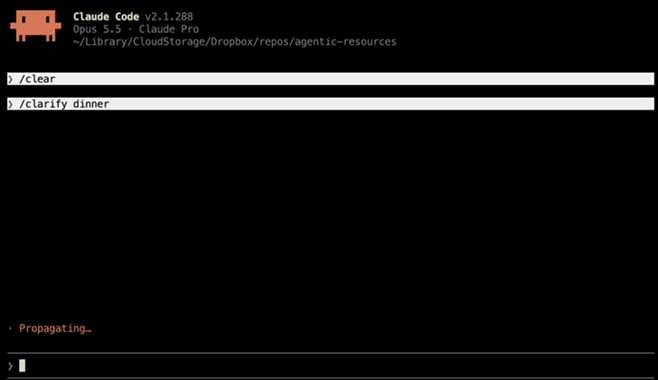

# Clarify

**Clarify your intent** through incremental interrogation.

## 💡 Why Clarify Exists
While using Matt Pocock's delightful [grill-me skill](https://github.com/mattpocock/skills/blob/main/skills/productivity/grilling/SKILL.md), I began to notice extraneous cognitive load along with other [challenges](#challenges). This skill approaches the challenges [differently](#️-differences-from-grill-me), yielding additional [benefits](#benefits) as a result.

Key results are 2-4x faster decision exploration and quick capture for specs and decision records.

For example, getting from `/clarify dinner` to the decision tree output below took 3 minutes and 17 keystrokes (excluding `enter`).

## Example Output

Notation: `?` question, `.` answer, `+` pro, `-` con, `*` decision.

```txt
What should I do about dinner?
    * cook at home
        + no travel with kids
        - cleanup
        Assumptions?
            . you have ingredients for a meal on hand
            . you would cook
            . control over ingredients won't change decision
            . leftovers for later meals won't change decision
            . prep time won't change decision
    . eat out
        + no cleanup
        - travel with kids
        Assumptions?
            . you have a kid-friendly restaurant in mind
            . no prep won't change decision
    Who are you eating with?
        . family with kids
            How many people are eating?
                . 4
            Assumptions?
                . kids are old enough to sit through a restaurant meal
                . family has no dietary restrictions
                . kids will eat ordinary family meals
    Assumptions?
        . time allows cooking at home or eating out
        . eating out costs more than cooking at home
```
---


## Installation
npx skills: `npx skills add https://www.a-laughlin.com/agentic-resources --skill clarify -a claude-code -g`\
pnpm: `pnpm dlx skills add https://www.a-laughlin.com/agentic-resources --skill clarify -a claude-code -g`\
Claude plugin: `claude plugin marketplace add a-laughlin/agentic-resources` then `claude plugin install clarify@agentic-resources`\
gh: `gh skill install a-laughlin/agentic-resources clarify`\
curl: `curl -fsSL --create-dirs https://www.a-laughlin.com/agentic-resources/agent-skills/clarify/SKILL.md -o ~/.claude/skills/clarify/SKILL.md`\
--\
Swap `-a claude-code | ~/.claude/skills` for your agent (e.g.`cursor`, `~/.cursor/skills`, `~/.agents/skills`, …).

## Usage

In your favorite AI chat, `/clarify <problems, solutions, questions, ideas, anything...>`

## TBD

This is a very early version so much is in progress. It just hit the point where tweaks started making its behavior less consistent across models and sessions, so evals are the next step before further tweaks.

## Challenges
I encountered a few challenges using the original:
- **Scannability:** Paragraphs of free-form text and inline suggestions are slow to scan vs lists.
- **Consistency:** The default skill sometimes outputs lists to choose from, sometimes not. The inconsistent formatting creats unpredictability that slows down entry and comprehension speed.
- **Traceability:** Untyped options and assumptions go unrecorded, leaving no trace for decision records and specs.
- **Shareability:** The linear Q# format and spacing are too verbose and indirect for practical usage in decision records and specs.
- **Understandability:** Questions paragraphs mix options, pros, cons, and sub-questions inconsistently, slowing reasoning about the tree. The linear+batch format obscures tree relationships. Question batches overflow the visible window and require scrolling. "Q#" indexes + batching require remembering numbers and mixing them with typed concepts. The default skill inconsistently outputs lists, sometimes not. All of these slow comprehension through [extraneous cognitive load](https://thedecisionlab.com/reference-guide/psychology/cognitive-load-theory).
- **Anchoring bias:** A single recommendation anchors on that option, and missing null options anchor on "fixing what ain't broke".
- **Usability:** Answering by Q number takes lookups, scrolling, and typing. Good alternative suggestions show up inconsistently.

## Benefits
In addition to solving the above challenges, Clarify adds a few benefits:
- Quickly explore, generate, rescope, and decide options with hotkeys.
- Use in meetings to maintain shared context and focus \[1].
- Defer questions and stop/restart grilling when convenient.
- Store concise decision traces in specs, ADRs, and other decision records.

1. [IBIS notation](https://en.wikipedia.org/wiki/Issue-based_information_system) was designed to maintain shared group understanding when solving wicked problems like "What should we do about climate change?". I've used it to keep meetings of 2-30 attendees on track and productive.

## Tradeoffs
One benefit of free-form paragraphs is that they support intermingling decision traces with supporting data visualizations like images and tables. If you prefer mixing alternate data formats with your decision traces, semantic decision trees like IBIS will feel awkward. I prefer separating the decision traces from their supporting resources with a references section, so free-form paragraphs vs. decision trees don't matter.


## ⚖️ Differences from Grill-me

| Aspect | Grill-Me | Clarify |
| :--- | :--- | :--- |
| **Focus** | Many questions at once | One question at a time |
| **Context Structure** | Unstructured design tree | Semantically structured issue tree |
| **Context Presentation** | Unstructured paragraphs | logic paths |
| **Context Location** | Spread within and across split paragraphs | Relevant context colocated with latest question |
| **Context Finding** | Asking, remembering Q#s + scrolling + reading, ctrl+f in session history | scanning latest response, "tree" command |
| **Suggestions** | Inconsistent, unstructured | Consistent, structured, automatically suggested then confirmed and recorded |
| **Assumptions** | thinking + manual typing | Consistent, structured, automatically suggested then confirmed and recorded |
| **Responding** | "Q#" references | Hotkeys |
| **Usage Contexts** | Individual | Individual, Meetings, Decision Records, Specs |
| **Logical Conflict Resolution** | - | automated detection, suggestion, and hotkeyed resolution |
| **Pausing** | — | Defer questions, stop and resume |

## 📜 Credits
- Inspired by [@mattpocock](https://github.com/mattpocock)'s [grill-me skill](https://github.com/mattpocock/skills/blob/main/skills/productivity/grilling/SKILL.md).

## 📄 License
MIT © Adam Laughlin
